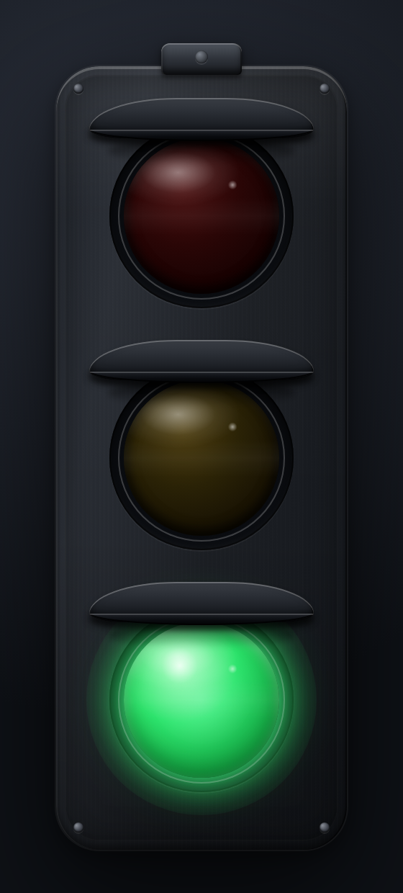
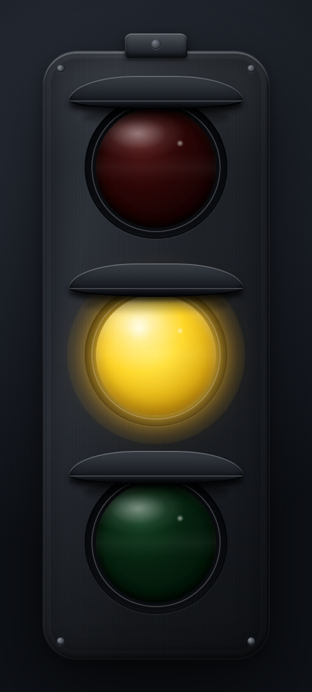
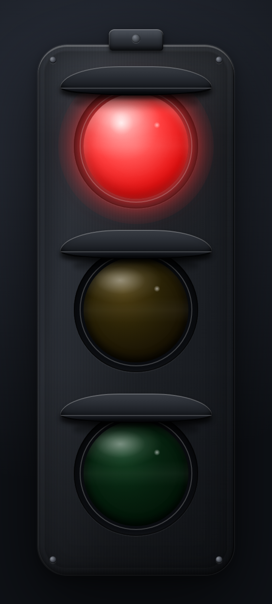

# Red Green Light

A desktop traffic light that reflects the live state of your Claude Code (and
soon, Codex) sessions.

<p align="center">
  
  
  
</p>

| State    | Light | Meaning                                          |
| -------- | :---: | ------------------------------------------------ |
| Idle     |   🟢  | No active session, or the agent finished.        |
| Working  |   🟡  | The agent is thinking or calling a tool.         |
| Waiting  |   🔴  | The agent is waiting for your input / a decision. |

The app lives in your menu bar. Click it to open a skeuomorphic floating
traffic light. Sits on top, gets out of the way.

## How it works

```
┌──────────────┐    HTTP POST    ┌─────────────────────┐
│ Claude Code  │ ──/events──────▶│ Red Green Light     │
│ hooks (HTTP) │                 │   axum on 127.0.0.1 │
└──────────────┘                 │   ↓ aggregate       │
                                 │   ↓ broadcast       │
                                 │ tray icon + UI      │
                                 └─────────────────────┘
```

The Tauri app starts a local HTTP server on `127.0.0.1:7878` and registers
Claude Code hooks (`SessionStart`, `PreToolUse`, `PostToolUse`,
`Notification`, `Stop`, `SubagentStop`, `SessionEnd`, `UserPromptSubmit`)
that POST their JSON payload directly to that endpoint. Each session is
tracked independently and the global color is the most severe state across
all active sessions (`red > yellow > green`).

Everything is local. No data leaves your machine.

## Install

### For users — download a pre-built .dmg

Grab the latest `.dmg` from the
[Releases page](https://github.com/jokeuncle/red-green-light/releases), drag
**Red Green Light.app** into `/Applications`, and run the hook installer:

```bash
git clone https://github.com/jokeuncle/red-green-light.git
cd red-green-light
./hooks/install.sh
```

The build is unsigned, so the first launch may need a right-click → *Open* to
get past Gatekeeper.

### For developers — build from source

Prerequisites: macOS 11+ (Windows / Linux untested), Node.js 18+, pnpm, Rust
toolchain, and `jq`.

```bash
git clone https://github.com/jokeuncle/red-green-light.git
cd red-green-light
./install.sh            # builds, copies to /Applications, installs hooks
```

The script accepts `--skip-build` and `--skip-hooks` for partial runs. For
day-to-day development:

```bash
pnpm install
pnpm tauri dev
```

### Verify

Open a new Claude Code session and ask it to do anything — the menu-bar
light should turn yellow as soon as the agent starts working, red when it
asks you something, and green when it stops.

To remove the hooks later:

```bash
./hooks/uninstall.sh
```

## State machine

| Hook event                                            | Session state |
| ----------------------------------------------------- | ------------- |
| `SessionStart` `UserPromptSubmit` `PreToolUse` `PostToolUse` `SubagentStop` `PreCompact` | working |
| `Notification`                                        | waiting       |
| `Stop` `StopFailure`                                  | idle          |
| `SessionEnd`                                          | session removed |
| (no event for 10 min)                                 | timed out → idle |

## HTTP API

| Endpoint              | Purpose                                        |
| --------------------- | ---------------------------------------------- |
| `POST /events`        | Receive a hook payload, mutate session state.  |
| `GET  /state`         | Return current snapshot (used by `/state/stream`).|
| `GET  /state/stream`  | Server-Sent Events stream of state changes.    |
| `GET  /health`        | Liveness check.                                |

Manual test:

```bash
curl -X POST http://127.0.0.1:7878/events \
  -H 'content-type: application/json' \
  -d '{"source":"claude-code","session_id":"demo","hook_event_name":"PreToolUse"}'
# → menu bar turns yellow
```

## Configuration

| Env var       | Default | Purpose                          |
| ------------- | ------- | -------------------------------- |
| `RGL_PORT`    | `7878`  | Local HTTP port the app listens on. |
| `CLAUDE_SETTINGS` | `~/.claude/settings.json` | Used by `install.sh` / `uninstall.sh`. |

## Roadmap

- [ ] Codex CLI integration (the protocol already accepts `source: "codex"`).
- [ ] System notifications + sound for the red state.
- [ ] Session history view in the floating window.
- [ ] Auto-start on login.
- [ ] Per-project filtering.

## Project layout

```
red-green-light/
├── src/                  # React floating window
│   └── components/TrafficLight.tsx    skeuomorphic traffic light
├── src-tauri/            # Tauri v2 (Rust) backend
│   ├── src/state.rs      session state machine + aggregation
│   ├── src/server.rs     axum HTTP + SSE
│   ├── src/tray.rs       menu-bar icon, dynamic color swap
│   └── icons/            tray + app icons (RGBA PNG)
├── hooks/                # Claude Code hook installer
│   ├── claude-hooks.json hook snippet
│   ├── install.sh        idempotent jq merge
│   └── uninstall.sh
└── scripts/              # build-time helpers
    ├── generate-icons.mjs  SVG → PNG via headless Chromium
    ├── snap.mjs            screenshot the floating window
    └── verify-e2e.mjs      black-box visual verification
```

## License

MIT — see [LICENSE](LICENSE).
